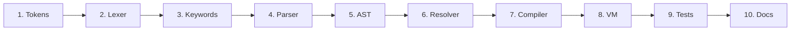

# Contributing Guide

This document describes how to contribute to the Sindlish language, including the standard workflow for adding new features and the code conventions to follow.

## Development Setup

```bash
# Clone the repository
git clone https://github.com/AmanatAliPanhwer/Sindlish.git
cd Sindlish

# Install dependencies
uv sync --all-groups

# Run tests
uv run pytest

# Run the interpreter
python main.py

# Run benchmarks
uv run python tools/bench/run.py
```

## 10-Step Pipeline for Adding a Feature

When adding a new language feature, follow this 10-step pipeline:



### Step 1: Tokens

If the feature requires new keywords or operators, add entries to `interpreter/frontend/tokens.py`:

```python
class TokenType(Enum):
    # ... existing tokens ...
    MY_KEYWORD = auto()  # New keyword
    MY_OPERATOR = auto()  # New operator
```

### Step 2: Lexer

If new tokens were added, update the Lexer (`interpreter/frontend/lexer.py`):

- Add single-character tokens to `_SINGLE_CHAR_TOKENS`
- Add compound operators to `_scan_compound_operator()`
- The identifier scanner will automatically pick up new keywords from the `KEYWORDS` dict

### Step 3: Keywords

If new keywords were added, update `interpreter/frontend/keywords.py`:

```python
KEYWORDS = {
    # ... existing keywords ...
    "mykeyword": TokenType.MY_KEYWORD,
}
```

### Step 4: Parser

Update the Parser (`interpreter/frontend/parser.py`):

- Add parsing logic for the new construct
- Update `parse_statement()` if it's a new statement type
- Update `parse_primary()` if it's a new expression type
- Add to the precedence chain if it's a new operator

### Step 5: AST Nodes

Add new AST node class(es) to `interpreter/frontend/ast_nodes.py`:

```python
class MyNewNode(Node):
    __slots__ = ("field1", "field2", "line", "column")

    def __init__(self, field1, field2, line=0, column=0):
        self.field1 = field1
        self.field2 = field2
        self.line = line
        self.column = column
```

### Step 6: Resolver

Add a resolve method to `interpreter/analysis/resolver.py`:

```python
def resolve_MyNewNode(self, node):
    self.resolve(node.field1)
    self.resolve(node.field2)
```

### Step 7: Compiler

Add a compile method to `interpreter/backend/compiler.py`:

```python
def compile_MyNewNode(self, node):
    self.compile(node.field1)
    self.compile(node.field2)
    self.emit(OpCode.MY_NEW_OPCODE, node=node)
```

### Step 8: VM

If the feature requires a new opcode:

1. Add the opcode to `interpreter/backend/opcodes.py`:

```python
class OpCode(IntEnum):
    MY_NEW_OPCODE = auto()
```

2. Add the handler to `interpreter/backend/vm.py`:

```python
def _op_my_new_opcode(self, frame, arg, line, column):
    # Implementation
    pass
```

3. Register in `_setup_dispatch_table()`:

```python
self.dispatch_table[OpCode.MY_NEW_OPCODE] = self._op_my_new_opcode
```

### Step 9: Tests

Add tests to `tests/test_<feature>.py`:

```python
class TestMyFeature:
    def test_basic(self):
        vm = run("my new syntax")
        assert extract_value(get_variable_value(vm, "x")) == expected

    def test_error_case(self):
        with pytest.raises(ExpectedError):
            run("invalid syntax")
```

### Step 10: Documentation

Update relevant documentation in `book/` (and the offline docs in `interpreter/offline_docs.txt`).

## License

Sindlish is licensed under the GNU General Public License, version 3 or later (`GPL-3.0-or-later`); see [`LICENSE`](LICENSE). By contributing you agree that your contributions are provided under the same license.

## Code Conventions

### General

- **No comments** in source code unless explicitly asked
- **No docstrings** on internal methods (only on `Interpreter.run_source` and CLI functions in `interpreter/cli.py`)
- Use **`__slots__`** on all classes for memory efficiency
- Use **frozen dataclasses** where appropriate (e.g. `Token`)

### Naming

- **Python files/modules:** `snake_case` (e.g. `ast_nodes.py`, `opcodes.py`)
- **Python classes:** `PascalCase` (e.g. `SdNumber`, `BytecodeFrame`)
- **Python methods:** `snake_case` (e.g. `compile_BinaryOpNode`)
- **Sindlish keywords:** lowercase Sindhi words (e.g. `agar`, `likh`)
- **Sindlish method names:** lowercase Sindhi words (e.g. `wadha`, `bachao`)
- **Opcodes:** `UPPER_SNAKE_CASE` (e.g. `LOAD_CONST`, `BINARY_ADD`)

### Error Messages

All error messages are written in Sindhi/Romanized Sindhi:

```python
raise LikhaiJeGhalti(f"Illegal akhar {char}.")  # "Illegal character"
raise NaleJeGhalti(f"'{name}' natho mehalain saghjay.")  # "not found"
raise QisamJeGhalti("... khe ... mein badal natho...")  # "cannot convert"
raise HalndeVaktGhalti("...")  # Runtime error
```

### AST Nodes

- All AST nodes inherit from `Node`
- Use `__slots__` for all fields
- Include `line` and `column` in `__slots__`
- Default `line=0, column=0` in constructor

### Object Protocol Methods

- All arithmetic/comparison/logical operations return `SdBool` or `SdNumber` or `SdResult`
- Division by zero returns `SdResult(GHALTI, ...)` instead of raising
- Type mismatches raise `QisamJeGhalti`

### Method Registration

When adding methods to collection types:

```python
# In the type's module (e.g. collections.py)
def my_method(self, args):
    # Implementation
    pass


FEHRIST_TYPE.register_method("mymethod", my_method)
```

## Testing Guidelines

- Write tests for every new feature
- Test both success and error cases
- Use `run()` to execute Sindlish code
- Use `extract_value()` for assertions
- Use `pytest.raises()` for error cases
- Run the full test suite before submitting: `uv run pytest`

## Project Structure

```
interpreter/
├── __init__.py        # Interpreter facade (pipeline orchestration) + __version__
├── cli.py             # CLI: run / repl / eval / tokens / ast / check / docs
├── errors.py          # Error types (DO NOT modify lightly)
├── repl.py            # REPL (syntax highlighting, completion)
├── offline_docs.txt   # `sindlish docs` offline reference (package data)
├── frontend/
│   ├── tokens.py      # TokenType enum (add new tokens here)
│   ├── keywords.py    # Sindhi keyword mappings
│   ├── lexer.py       # Character scanner
│   ├── ast_nodes.py   # All AST node classes
│   └── parser.py      # Recursive descent parser
├── analysis/
│   └── resolver.py    # Name resolution, slot allocation, type checking
├── backend/
│   ├── opcodes.py     # Bytecode opcodes (add new opcodes here)
│   ├── markers.py     # StarArgs/Kwargs marker operands
│   ├── compiler.py    # AST to bytecode compiler
│   ├── frame.py       # Execution frame
│   └── vm.py          # Stack-based virtual machine
├── objects/
│   ├── base.py        # SdType and SdShey (base classes)
│   ├── numbers.py     # SdNumber, SdBool
│   ├── strings.py     # SdString
│   ├── collections.py # SdList, SdDict, SdSet
│   └── core.py        # SdResult, SdFunction, SdNull
└── runtime/
    ├── env.py         # Environment (symbol table)
    └── builtins.py    # Built-in functions

main.py                # thin shim → interpreter.cli (for `python main.py`)
sindlish.spec          # PyInstaller definition
install.sh             # macOS/Linux install-from-source
book/                  # the mdBook (canonical docs)
# vscode-extension/, tools/, tests/, examples/, roadmap/ — see book/src/repo-map.md
```

## Common Patterns

### Adding a New Built-in Function

1. Add the function to `interpreter/runtime/builtins.py`:

```python
@register(SimpleBuiltins.functions)
def my_func(self, args):
    # Implementation
    return result
```

2. It's automatically available globally (registered via `@register`)

### Adding a New Collection Method

1. Add the method function to the appropriate file in `interpreter/objects/`

2. Register it on the type singleton:

```python
FEHRIST_TYPE.register_method("mymethod", my_method_function)
```

3. Add the method name to the VS Code extension's completion triggers in `tools/generate_grammar.py`

### Adding a New Opcode

1. Add to `interpreter/backend/opcodes.py`
2. Add handler to `interpreter/backend/vm.py`
3. Register in `_setup_dispatch_table()`
4. Add compiler support in `interpreter/backend/compiler.py`

## Pull Request Guidelines

1. **Fork and branch** from `main`
2. **Follow the 10-step pipeline** for new features
3. **Write tests** for all new functionality
4. **Run the full test suite** before submitting
5. **Update documentation** if adding user-facing features
6. **Keep commits focused** — one feature/fix per commit
7. **Write clear commit messages** describing the change
