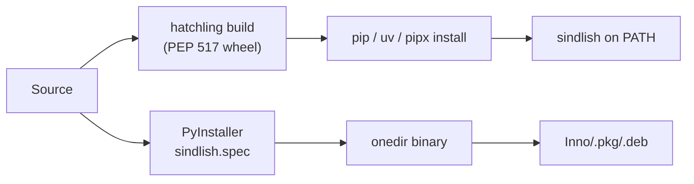

# Appendix: Distribution, Packaging & CI

<div class="youarehere">📍 <strong>You are here:</strong> Appendix · Reference</div>

How a source checkout becomes a running `sindlish` binary on Windows, macOS, and Linux.

## The installable seam

The project ships as a proper PEP 517 package (hatchling):

- **Version (single source):** `interpreter/__init__.py` → `__version__`. `pyproject.toml` reads it via `[tool.hatch.version] path`; the CLI, REPL banner, and the release workflow all derive from it.
- **Console script:** `sindlish = "interpreter.cli:main"`. The CLI lives in `interpreter/cli.py`; `main.py` at the repo root is a thin shim kept for `python main.py` runs from a checkout.
- **Offline docs:** `interpreter/offline_docs.txt` is package data, so `sindlish docs` works whether run from the repo, installed via pip, or inside a frozen PyInstaller binary.



## Installing

```bash
# From source (macOS/Linux) — real installer, uses uv, pipx or pip:
./install.sh

# Same thing by hand:
uv tool install git+https://github.com/Sindlish/Sindlish.git
pipx install git+https://github.com/Sindlish/Sindlish.git
```

## Building the binary (`sindlish.spec`)

`pyinstaller --noconfirm sindlish.spec` produces a **onedir** build in `dist/sindlish/`. The spec file:

- bundles `interpreter/offline_docs.txt` as data, so `sindlish docs` works in the frozen app
- picks the platform icon (`tools/sindlish.ico` on Windows, `tools/sindlish.icns` on macOS)

Icons are generated from the VS Code logo by `tools/generate_icons.py` (needs Pillow, in the `dev` group).

## Platform installers

| Platform | Tool | Output |
|----------|------|--------|
| Windows | Inno Setup (`installer.iss`, run via `ISCC.exe`) | `dist/sindlish-installer-win64.exe`, PATH + Start Menu |
| macOS | `pkgbuild` | `.pkg` → `/usr/local/bin` |
| Linux | `dpkg-deb` | `.deb` → `/usr/local/bin`, hicolor icon |

## CI (`uv` everywhere)

| Workflow | Triggers | Steps |
|----------|----------|-------|
| `.github/workflows/ci.yml` | push/PR to `main` | `uv sync --all-groups` → `uv run pytest` |
| `.github/workflows/release.yml` | release published | matrix (3 OS) → icons → `pyinstaller sindlish.spec` → platform installer → upload artifacts to the release |

Versions in the macOS `.pkg` and Linux `.deb` are read at build time from `interpreter.__version__`, so they can't drift from the source.

## Benchmarks

`tools/bench/run.py` compares Sindlish vs Python vs Rust (fibonacci, loop sum, primes) with a Rich live dashboard:

```bash
uv run python tools/bench/run.py
```

<div class="recap">
<p>A single version, a real install script, and one spec file — the packaging seam now has one owner and no hand-synced copies.</p>
</div>