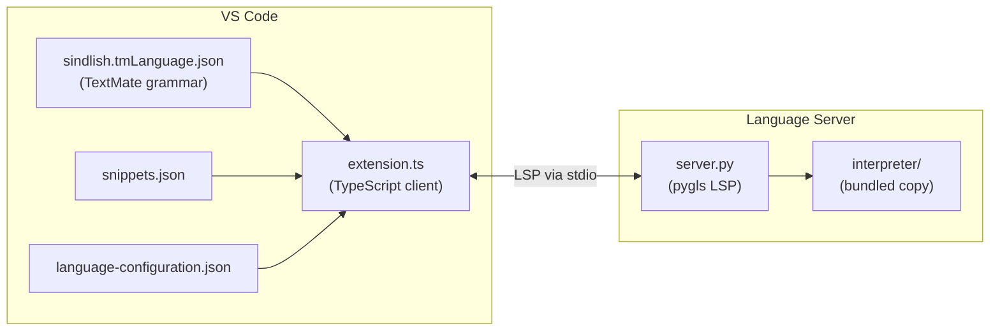

# Appendix: The VS Code Extension

<div class="youarehere">📍 <strong>You are here:</strong> Appendix · Reference</div>

The VS Code extension provides syntax highlighting, autocompletion, diagnostics, hover, and go-to-definition for `.sd` files, backed by a bundled copy of the interpreter.

## Architecture



## Components

1. **Client (`src/extension.ts`)** — starts the Python server as a child process, shows a status-bar indicator, wires `publishDiagnostics`.
2. **Server (`server/server.py`)** — a pygls LSP that, on document open/change, runs the full pipeline (lex → parse → resolve → compile, VM execution disabled) and reports errors. It provides keyword/builtin/local-symbol completions plus type-aware method completions after `.`.
3. **TextMate grammar** (`syntaxes/sindlish.tmLanguage.json`) — auto-generated by `tools/generate_grammar.py`, which also regenerates `sindlish-definitions.json` and `language-configuration.json` by introspecting `KEYWORDS` and `SimpleBuiltins`.
4. **Language configuration** — `#` / `/* */` comments, bracket pairs.
5. **Snippets** — `kaam`, `agar`, `jistain`, `pakko`, `adad`, `fehrist`, `ok`, `ghalti`.

## The bundled interpreter

`server/interpreter/` holds a complete working copy of the interpreter, so the Language Server works without a global Sindlish install. It is **not** edited by hand:

- `tools/update_extension.bat` **mirror-syncs** it: it deletes `vscode-extension\server\interpreter` and re-copies `interpreter\` fresh, then regenerates grammar files, bumps the extension version, and runs `vsce package`. Because it's a mirror (not additive xcopy), stale/dead files can never linger in the bundle.
- Both `/server/interpreter` and `/out` are gitignored; `out/` is compiled output produced by `npm run compile`.

## Building the extension

```bash
cd vscode-extension
npm install
vsce package          # produces sindlish-<version>.vsix
code --install-extension sindlish-0.1.1.vsix
```

Other developer tools under `tools/`: `lint.py` (lex+parse a `.sd` file and report), `generate_icons.py` (Pillow: `.ico`/`.icns`/`.bmp`/`.png` from the logo).

<div class="recap">
<p>The extension's copy of the interpreter is a build artifact with a single source of truth (the repo root), refreshed by a mirror-sync script.</p>
</div>