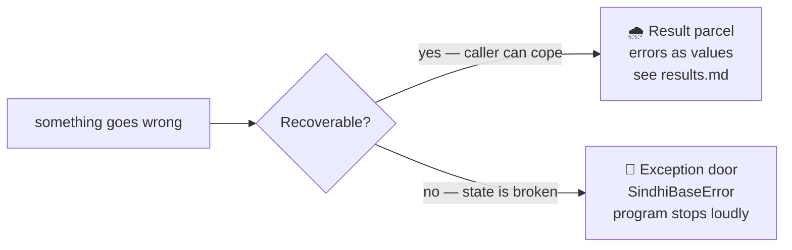
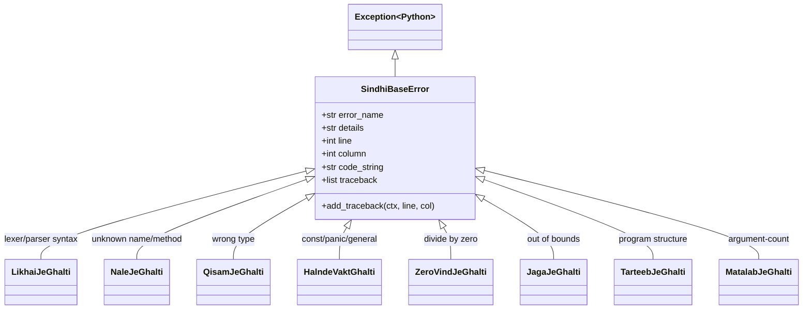

# Exceptions & Pretty Error Reports

<div class="youarehere">📍 <strong>You are here:</strong> Part Five · When Things Go Wrong — 2 of 2</div>

## 🌱 The hook

Results handle *expected* failures gracefully. But some situations are genuinely unrecoverable — the parser met gibberish, a `pakko` was violated, a bare `ghalti("no.")` statement fired. For those, Sindlish keeps a classic exception hierarchy, and wraps it in one of the nicest touches of the whole codebase: a renderer that prints errors like a craftsman's signature.

## 🧠 Mental model: two doors for two kinds of trouble



Both doors lead to the same wall display. The difference is *who* decides what happens next: your code (Results) or the runtime (exceptions).

## 🔬 Under the hood

### The family tree

Every error is a tiny sentence ending in *Ghalti* (mistake) — see the [glossary](glossary.md) for translations:



All eight subclasses live in `interpreter/errors.py:116-186` and differ only in their name — the payload shape is identical, which keeps raising sites terse.

### The anatomy of a report

`ErrorReporter.report()` (`errors.py:55`) writes to **stderr** in three sections:

```text
ZeroVindJeGhalti: Zero (0) saan vand natho kare saghjay.   ① header

Call Stack (most recent call last):                    ② call stack (optional)
  --> Line 6, in main
    bhag(9, 0)
  --> Line 2, in bhag
    r = a / b?

At Location:                                          ③ code context + caret
   1 | kaam bhag(adad a, adad b) {
   2 |     r = a / b?
           ^
```

1. **Header** — bold red `ClassName:` + human details.
2. **Call stack** — only when traceback entries exist; innermost frame last, each with its source line.
3. **Location** — one line above, the offending line, one below; a yellow `^` under the exact column. Tab expansion is handled so carets land correctly even in tab-indented files.

Colors are plain ANSI codes from a tiny `Colors` class (`errors.py:4`) — no dependency, works in every terminal that matters.

### Where tracebacks come from — two sources

This detail explains most "why does this error show different info" confusion:

| Source | Filled by | When |
|---|---|---|
| **VM walk** | `VM._build_traceback()` (`vm.py:323`) | exception raised during execution; walks live frames using `line_col_map[ip-1]` |
| **Parcel capture** | `SdResult.capture_traceback()` (`objects/core.py:25`) | frozen at Ghalti *creation*; replayed verbatim if raised later via `!!` / `.lazmi()` |

`_build_traceback` deliberately skips work when `error.traceback` is already non-empty — a Result-born exception arrives pre-traced, and its original birthplace wins over where it finally detonated. That's why `.lazmi()` reports show where the division failed, not just where you panicked about it.

### The reconstruction registry

One more piece earns its keep at runtime:

```python
# interpreter/errors.py:191
ERROR_MAP = {
    "LikhaiJeGhalti": LikhaiJeGhalti,
    …
}
```

Parcels carry `_error_cls` as a *string*. When `!!`, `.lazmi()`, or strict consumption raises, `ERROR_MAP` turns that string back into the right class. It exists because `SdResult` can't import the error classes directly (circular import: errors ← objects ← errors); the registry breaks the cycle with a dict.

### Exception laundering at the dispatch boundary

Python exceptions crossing into user programs would leak internals, so `SdShey.call_method` (`objects/base.py:249`) translates at the border:

| Python raises | User sees |
|---|---|
| `TypeError` | `QisamJeGhalti` |
| `IndexError` | `JagaJeGhalti` |
| `ZeroDivisionError` | `ZeroVindJeGhalti` |
| already-`SindhiBaseError` | passed through untouched (position preserved) |
| anything else | generic `HalndeVaktGhalti` |

The VM adds a second layer of the same policy around calls and builtins (`vm.py:_invoke`, `_op_call_method`). Belt and suspenders — users should never meet Python's own exception names.

> 💡 **Contributing note:** when you add an operation, decide *up front* which door it uses. If callers could plausibly recover, return a Result (like `/` does). If the situation means broken state or broken promises, raise. The [safety chapter](safety.md)'s enforcement map shows where each decision landed historically.

<div class="recap">
<p>Two doors: Result parcels for recoverables, SindhiBaseError for fatal ones.</p>
<p>Reports = header + optional call stack + context lines with caret, all to stderr.</p>
<p>Tracebacks come from either the live-frame walk or frozen parcel capture; capture wins.</p>
<p><code>ERROR_MAP</code> re-materializes the right exception class from a parcel's string tag.</p>
<p>Python exceptions are laundered into Sindlish ones at every dispatch boundary.</p>
</div>
