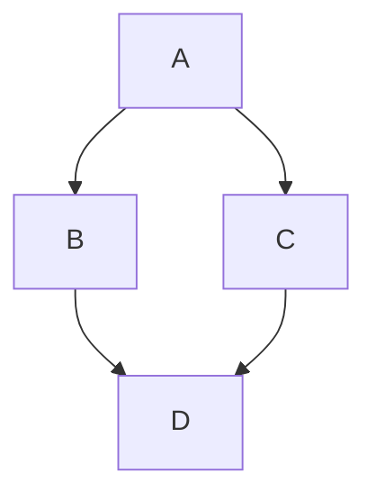

# MRO & C3 Linearization, Step by Step

<div class="youarehere">📍 <strong>You are here:</strong> Part Six · The Object Zoo — 2 of 3</div>

## 🌱 The hook

When two parents both define a method, which wins? Answering that question *deterministically, for any family tree* is the Method Resolution Order (MRO). Sindlish implements the same algorithm Python uses — **C3 linearization** — in `_compute_mro`/`_c3_merge` (`interpreter/objects/base.py:67-124`).

Today no built-in type sets `bases`, so this machinery is dormant — but it's the foundation for the planned `jamaat` classes feature. This chapter builds C3 from scratch, walks a real diamond by hand, and ends with **two verified sharp edges** you should know before building on it (both were found and fixed in the v0.1.1 sweep — see closed issues #17 and #18).

## 🧠 Mental model: merging waiting lists fairly

C3 treats each class's ancestry as an ordered waiting list. To build L(C) — the final lineup for class `C`:

> Take classes' lists + a list starting with `C` itself. Repeatedly: pick whichever head isn't sitting in anyone else's *tail* (nobody still waits behind it), append it, cross it off everywhere. Stuck? The hierarchy is inconsistent — refuse.

The "not in any tail" rule is what makes children always outrank parents and preserves every parent's own left-to-right promise.

## 🔬 Under the hood

### Worked example: the classic diamond



Build `L(D)` where `D(B, C)`, both inheriting `A` (Python's answer: `D, B, C, A`):

| Round | Lists | Pickable heads | Action |
|---|---|---|---|
| 0 | `[B,A] [C,A] [D]` | B ✓ | take **B** |
| 1 | `[A] [C,A] [D]` | A ✗(C waits behind A)· C ✓ | take **C** |
| 2 | `[A] [A] [D]` | A ✓ | take **A** |
| 3 | `[] [] [D]` | D ✓ | take **D** |

→ `(D, B, C, A)` — children beat parents, B beats C (declaration order), A arrives exactly once, at the front-of-the-back.

Lookup then means: walk that list; first type whose skill book has the name wins.

```python
# interpreter/objects/base.py:146
def lookup_method(self, name):
    for type_obj in self.mro:
        method = type_obj._methods.get(name)
        if method is not None:
            return method
    return None
```

MROs are computed lazily once per type and cached (`_mro_cache`); assigning new `bases` invalidates the cache via the property setter — verified working during this book's research.

### ⚠️ Sharp edge #1 — self sits at the wrong end

Current code returns `tuple(result) + (self,)` (`base.py:84`) instead of merging `(self,)` as the first list. Verified consequence with real `SdType`s:

```python
A.register_method("hello", from_a)
B = SdType("B", bases=(A,))
B.register_method("hello", from_b)
B.lookup_method("hello")  # → A.hello  (!!)
```

Because B's MRO came out `(A, B)`, the *ancestor* wins — overriding is inverted. Python would produce `(B, A)`. One-line fix direction: prepend `(self,)` to the merge inputs, drop the trailing append. Fixed in the v0.1.1 MRO sweep (issue #17) — but read on before classes ship.

### ⚠️ Sharp edge #2 — impossible hierarchies fail silently

Python raises `TypeError: Cannot create a consistent MRO…`. Sindlish's `_c3_merge` just breaks out of its loop and returns whatever it gathered. Verified worst case:

```python
F = mk("F")
G = mk("G")
FA = mk("FA", F, G)
GA = mk("GA", G, F)
HA = mk("HA", FA, GA)
HA.mro  # → (HA,)   — both parents silently gone!
```

No exception, no truncation warning: lookups on HA would miss everything FA/GA define. The fix belongs in the same PR as #1: when no head qualifies, raise.

### Why C3 and not "just DFS"?

DFS through the diamond would visit A twice or let B's copy of A hide C's view of it. C3 guarantees three properties, worth memorizing as a checklist for tests: children precede parents · parents keep their relative order · each class appears exactly once.

<div class="recap">
<p>MRO = fair merge of waiting lists; "head not in any tail" is the whole trick.</p>
<p>Diamond D(B,C) → D,B,C,A by hand; lookup = first hit walking that order.</p>
<p>Cached until <code>bases</code> changes.</p>
<p>Known defects (verified): self-last ordering inverts overriding; stuck merges truncate silently. Both logged — fix before <code>jamaat</code>.</p>
</div>
