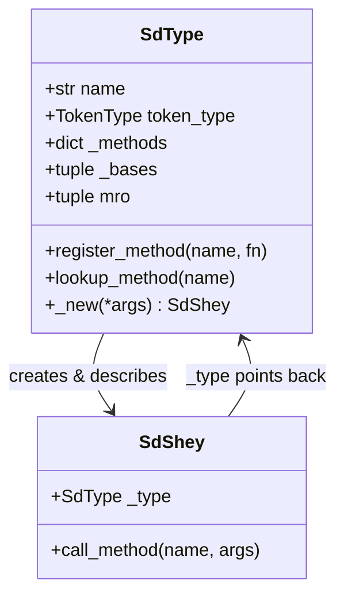
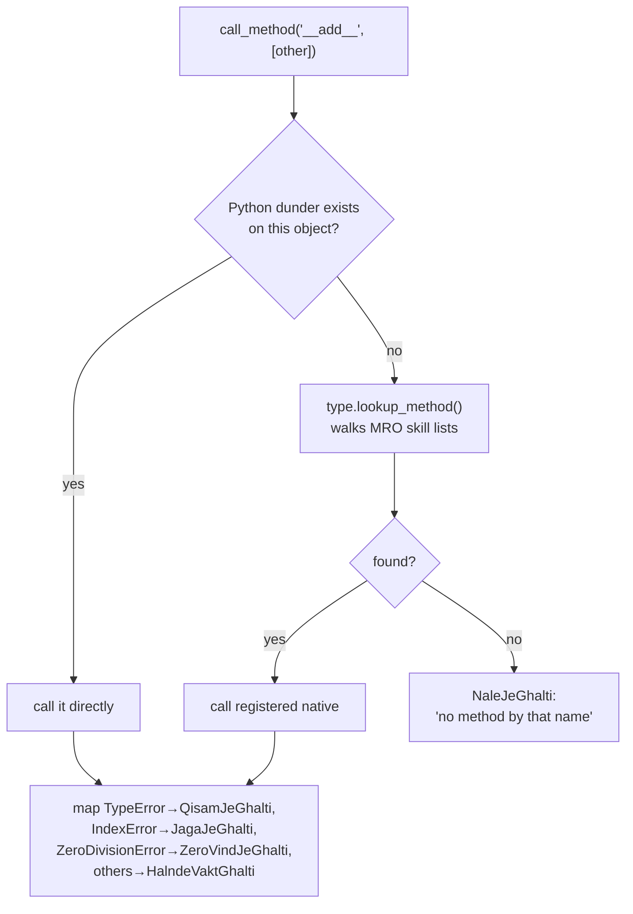

# SdType & SdShey: Every Value's DNA

📍 <strong>You are here:</strong> Part Six · The Object Zoo — 1 of 3

## 🌱 The hook

The VM only knows two verbs: *push* and *pop*. Every behavior — adding, indexing, printing — lives in the values themselves. So what *is* a Sindlish value? Two classes in `interpreter/objects/base.py` answer that: **`SdType`** (the type objects) and **`SdShey`** (*shey* = "thing", the base every value inherits).

Types are singletons (`ADAD_TYPE`, `LAFZ_TYPE`, … created once at import). Instances are plain Python objects whose `_type` slot names their type. It's a hand-rolled miniature of CPython's `PyTypeObject`.

## 🧠 Mental model: ID card + skill list

- **`SdType`** = the ID-card office: prints cards (name, token), keeps the master **skill list** per type, and knows each type's family tree (for MRO).
- **`SdShey`** = the citizen: carries one card reference and one shared talent — `call_method()`, the two-step dispatcher used for *every* operation in the VM.

## 🔬 Under the hood

### Dispatch: the two-step lookup

Every operation funnels through one method (`base.py:271`):

Why two steps? Speed and history. Hot operators (`+ - [] ==`) are Python dunders on subclasses — a direct attribute hit. Named methods (`wadha`, `tarteeb`) live in `_methods` dicts on the *type singleton*, so they cost nothing per-instance and are shared across all instances.

### Reference counting… removed

An early prototype carried CPython-style `incref/decref/_dealloc` on every object, but nothing ever called them (CPython's GC does the real work). The vestigial refcount machinery was **removed in #32**; no object carries a `_ref_count` slot today.

### Truthiness: one function to rule conditions

`sd_truthy()` (`base.py:190`) is tiny and everywhere: Results unwrap (Ok → its value's truthiness; Ghalti → **true** — an error is information), everything else defers to Python. Conditions, loops, `aen/ya/nah` all route through it.

### Instance creation

`SdType._new()` allocates via the stored `_instance_class` and runs `__init__`. You'll rarely touch it until classes land; the interesting part is that types are *callable*: `ADAD_TYPE(5)` builds an `SdNumber`.

Two pillars: <code>SdType</code> (identity, skills, family) and <code>SdShey</code> (card + dispatch).

Dispatch = dunder first, then MRO'd registry; exceptions laundered at the border.

The vestigial refcount is gone; truthiness is centralized in <code>sd_truthy</code>.

