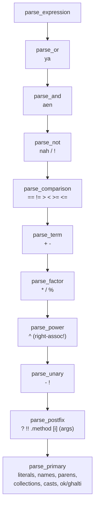

# The Parser: Tokens → Trees

<div class="youarehere">📍 <strong>You are here:</strong> Part Two · Front of House — stage 2 of 5</div>

## 🌱 The hook

The lexer hands you a flat list of tokens — but programs aren't flat. `a + b * c` isn't "five things in a row"; it's a specific *shape* of meaning. The parser (`interpreter/frontend/parser.py`, ~1278 lines) turns the token stream into that shape: a tree, the **AST** (Abstract Syntax Tree), built from the 36 node classes in `ast_nodes.py`.

Mental model: **assembling furniture from an instruction sheet.** Each grammar rule is one step; each step produces one node; steps nest inside steps until the whole program stands assembled.

## 🧠 Mental model: precedence by nesting

Sindlish uses **recursive descent** parsing — the friendliest technique there is. There's one method per grammar rule, and operator precedence is encoded not in tables but in *which method calls which*:



The further down you go, the *tighter* things bind. That's the entire trick. Two details worth pausing on:

- **`^` is right-associative** (`parser.py:622`): `parse_power` recurses into itself for the right side, so `2 ^ 3 ^ 2` means `2 ^ (3 ^ 2) = 512`, while `+`/`*` loop left-to-right.
- **Unary minus binds tighter than `^`**: `-2 ^ 2` parses as `(-2) ^ 2 = 4`. This differs from Python and is a *documented language convention* — do not "fix" it toward Python's `-4`.

## 🔬 Under the hood

### Statements first, expressions second

`parse_statement()` (`parser.py:130`) peeks at one token and dispatches:

| First token | Produces |
|---|---|
| `agar` | `IfNode` (+ `else_if_bodies` for `yawari` chains) |
| `jistain` | `WhileNode` |
| `har … mein … { }` | `ForNode` |
| `kaam` | `FunctionNode` |
| `wapas` | `ReturnNode` |
| `tor` / `jari` | `BreakNode` / `ContinueNode` |
| `pakko` or a datatype token | assignment (declaration form) |
| `IDENTIFIER x` followed by `=` or `:` | assignment |
| `IDENTIFIER` otherwise | expression statement (e.g. a call like `likh("hi")`) |
| `{` | bare block |
| `aalmi name` / `bahari name` | `GlobalNode` / `NonLocalNode` |

Everything else falls through to `parse_expression()` — which is also how `likh("salam")` really parses today: an identifier followed by `(args)` becomes a `CallNode`.

### Declarations: three spellings, one node

All of these become an `AssignNode` (`parser.py:1032`):

```sd
adad x = 5          # type-first
x: adad = 5         # postfix annotation
pakko PI = 3.14     # constant (value required!)
lafz name           # declaration with implicit default ("")
fehrist[adad] nums  # typed collection, default []
```

Nice touches inside `parse_assignment`:

- **Missing initializer?** You get a sensible zero value via `get_default_value_node()` — `0`, `0.0`, `""`, `koorh`, or `khali`. But `pakko` without a value is rejected up front: *"Pakkey laai value lazmi aahe"* — constants must be born with their value.
- **Element types** are parsed by `_parse_type_annotation()`: `fehrist[adad]`, `majmuo[lafz]`, and two-slot dicts `lughat[lafz, adad]`.

### Blocks, and a subtle handshake with `warna`

`parse_block()` loops statements until `}` — or until it sees `WARNA`. Why would a block stop at *"or else"*? Because of this legal pattern:

```sd
agar x > 5 { likh("big") }
warna { likh("small") }
```

The `{…}` of the if-body ends, newlines are skipped, and the *if-parser* (not the block parser) consumes `warna`. The block parser's WARNA check exists so that when blocks are parsed in contexts where `warna` follows immediately, ownership stays with `parse_if`. A small but real coupling between the two methods.

An unclosed block dies with position info pointing at the **opening** brace — `"Block band natho thayo; '}' na milyo."`

### Calls, kwargs, and markers

Call arguments (`parse_call_arguments`, `parser.py:880`) collect four buckets: positional args, `(name, value)` keyword pairs, one `*expr`, one `**expr`. The compiler later encodes keywords as marker objects in the constant pool so runtime strings can never impersonate parameter names — full story in [compiler.md](compiler.md).

### Method chains: where Results hide

After any primary expression, `parse_postfix` loops over trailing `.name`, `[index]`, `(args)`, `?`, `!!`. Inside `_parse_method_chain` there's a special case with big consequences (`parser.py:741`):

```python
if method_name in ("bachao", "lazmi"):
    … return ResultMethodCallNode(node, method_name, args[0])
```

`.bachao(fallback)` and `.lazmi(msg)` get their own AST node and eventually their own opcodes — they're part of the Result system, not ordinary method calls. Everything else becomes `MethodCallNode` (with parens) or `GetAttrNode` (without), like `r.ok` / `r.ghalti`.

### Dict or set? One peek decides

Both start with `{`. `parse_dict_set` (`parser.py:1204`) parses the first expression; if the next token is `:` → dict, else → set. Empty `{}` is a dict; use `majmuo()` for an empty set. Chained comparisons (`a < b < c`) are rejected outright with a message telling you to write `(a < b) aen (b < c)`.

## Seeing the tree yourself

```
> python main.py ast demo.sd        # demo.sd contains:
                                    #   adad x = 3 + 4
                                    #   likh(x * 2)

ProgramNode(statements=[
  AssignNode(name='x',
    value=BinaryOpNode(left=NumberNode(value=3),
                       op=PLUS('+'),
                       right=NumberNode(value=4)),
    type=<TokenType.ADAD: 1>, has_explicit_type=True, …),
  CallNode(name='likh', args=[BinaryOpNode(
      left=VariableNode(name='x'), op=MUL('*'),
      right=NumberNode(value=2))])])
```

Read the shape, not the words: `3 + 4` is *inside* the AssignNode's value slot; `x * 2` is *inside* the call's argument. Precedence became geography.

`main.py ast` prints pre-resolution ASTs and handles `kaam` definitions fine — `FunctionNode.slot_metadata` is initialized at construction, so a function's AST print is indistinguishable from any other node.

## Where errors come from

Every parser failure raises `LikhaiJeGhalti` with line/column *and the source text*, which is what powers the pretty caret display you'll meet in [errors-reporting.md](errors-reporting.md). Messages are Sindhi sentences — `'yawari' je shart khaan poe '{' lazmi aahe.` — consistent enough that after a week you'll parse them faster than English ones.

One more reserved word: `match` lexes fine but the parser refuses it with *"abhi support natho tho; hale roadmap mein aahe"* — the AST nodes already exist, waiting for implementation.

<div class="recap">
<p>Recursive descent: precedence lives in the call graph; deeper call = tighter binding.</p>
<p><code>^</code> is right-associative; unary minus binds tighter than <code>^</code> (deliberate).</p>
<p>Three declaration spellings collapse into <code>AssignNode</code>; missing initializers get zero values, consts refuse to.</p>
<p><code>.bachao/.lazmi</code> are special-cased into Result nodes during postfix parsing.</p>
<p><code>{</code> disambiguates dict vs set by peeking for <code>:</code>.</p>
</div>
