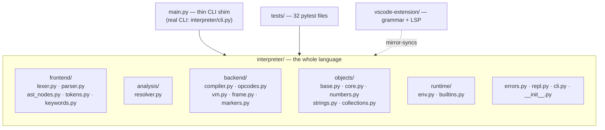

# The Repository Map

📍 <strong>You are here:</strong> Part One · The Big Picture

Before we open drawers, learn the floor plan. The repo has exactly one room that matters daily (`interpreter/`) and a hallway of supporting rooms.

## `interpreter/` — room by room

| Path | Lines | One-breath summary |
|---|---|---|
| `frontend/lexer.py` | 328 | Characters → tokens. Dispatch table for simple chars, methods for strings/numbers/operators. |
| `frontend/tokens.py` | 104 | `TokenType` enum (57 members) + frozen `Token` dataclass. |
| `frontend/keywords.py` | 53 | The Sindhi→TokenType dictionary. **Adding a keyword starts here.** |
| `frontend/ast_nodes.py` | 368 | 32 node classes; each carries `(line, column)`. |
| `frontend/parser.py` | 1257 | Recursive-descent parser; precedence via method-call nesting. |
| `analysis/resolver.py` | 834 | Scope stack, slot allocation, closure capture analysis, static type checks. |
| `backend/opcodes.py` | 167 | The 50-opcode `IntEnum` + operand parsing. |
| `backend/compiler.py` | 787 | AST → bytecode; two-phase jump patching; per-function code blocks. |
| `backend/vm.py` | 1457 | Stack machine: dispatch table, frames, all runtime checks & Result ops. |
| `backend/frame.py` | 82 | `BytecodeFrame`: instructions, slots array, closure cells, `ip`. |
| `backend/markers.py` | 36 | Marker operands (`StarArgsMarker`, `KwargsDictMarker`, `KwargMarker`). |
| `objects/base.py` | 321 | `SdType` (types + MRO/C3) and `SdShey` (base value + dispatch). |
| `objects/core.py` | 258 | `SdResult`, `SdFunction`, `SdNull`, closure `Cell`. |
| `objects/numbers.py` | 260 | `SdNumber` (int *and* float), `SdBool`. Division returns Results! |
| `objects/strings.py` | 104 | `SdString`. |
| `objects/collections.py` | 694 | List/dict/set/range + all registered native methods. |
| `runtime/env.py` | 78 | Globals `Environment`: name → `VariableRecord(value, type, is_const)`. |
| `runtime/builtins.py` | 169 | `likh`, `puch`, `lambi`, `majmuo`, `silsilo`, `qisam`. |
| `errors.py` | 200 | Error hierarchy + ANSI-pretty `ErrorReporter`. |
| `repl.py` | 197 | Interactive shell with highlighting/completion. |
| `cli.py` | ~270 | The actual CLI: `run / repl / eval / tokens / ast / check / docs`. |
| `__init__.py` | 89 | `Interpreter` facade + `__version__` (single source). |

> 🧭 **Orientation trick:** when reading an unfamiliar part of the code, ask *"which stop of the journey is this?"* Everything in `frontend/` happens before execution; everything in `backend/` happens during it; `objects/` is the vocabulary both halves share.

## Outside the core

- **`main.py`** — thin shim into `interpreter.cli`, kept for `python main.py <cmd>` from a checkout. Everything gets created in `interpreter/`.
- **`sindlish.spec`** — PyInstaller definition (bundles `offline_docs.txt`, picks the platform icon).
- **`tests/`** — one file per feature area (`test_typed_variables.py`, `test_closures.py`, …). Run with `uv run pytest`.
- **`examples/`** — tiny `.sd` programs (`hello.sd`, `factorial.sd`, `star_args.sd`).
- **`vscode-extension/`** — TextMate grammar plus a small LSP that consumes a mirror-synced copy of the interpreter. `tools/update_extension.bat` refreshes it.
- **`book/`** — this mdBook; the canonical documentation. (The old `docs/` website submodule and `developer-docs/` were removed.)
- **`tools/`** — icon generation, grammar generation, lint, the `tools/bench/` cross-language timing harness, and the extension updater.
- **`roadmap/`** — `ROADMAP.md` (the narrative); live work tracking lives in [GitHub milestones](https://github.com/Sindlish/Sindlish/milestones).

## Where do I change…?

A preview of the map you'll use constantly:

| "I want to…" | Touch first | Full walkthrough |
|---|---|---|
| add a keyword | `frontend/keywords.py` → `tokens.py` → parser → compiler | [contributing.md](contributing.md) |
| add a builtin | `runtime/builtins.py` | [runtime.md](runtime.md) |
| add a collection method | `objects/collections.py` bottom section | [type-zoo.md](type-zoo.md) |
| add an opcode | `opcodes.py` → compiler → VM dispatch table | [compiler.md](compiler.md) |
| tweak type checking | `resolver.py` (+ `vm._check_type`) | [typing-rules.md](typing-rules.md) |
| change error messages | `errors.py` or raiser site | [errors-reporting.md](errors-reporting.md) |
| repackage / release | `pyproject.toml` · `sindlish.spec` · `install.sh` | [appendix-distribution.md](appendix-distribution.md) |

<code>interpreter/</code> = frontend (before run), backend (during run), objects (shared vocabulary).

The <code>tokens</code>/<code>ast</code>/<code>check</code> CLI commands are your X-ray glasses.

The "Where do I change…?" table is the fastest route into any task.

