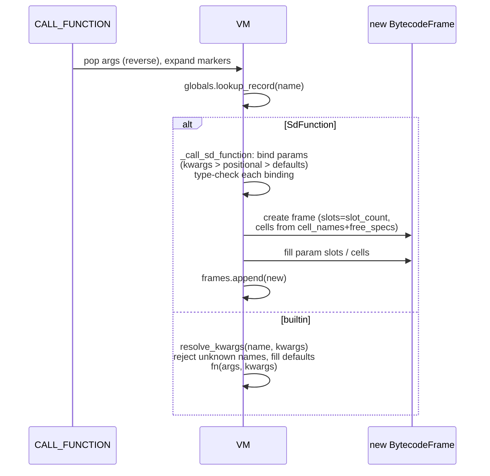
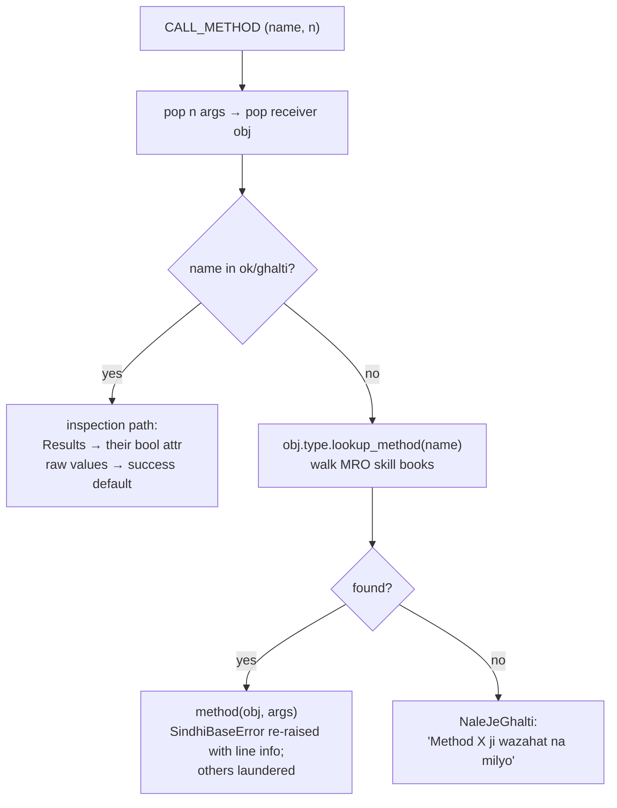
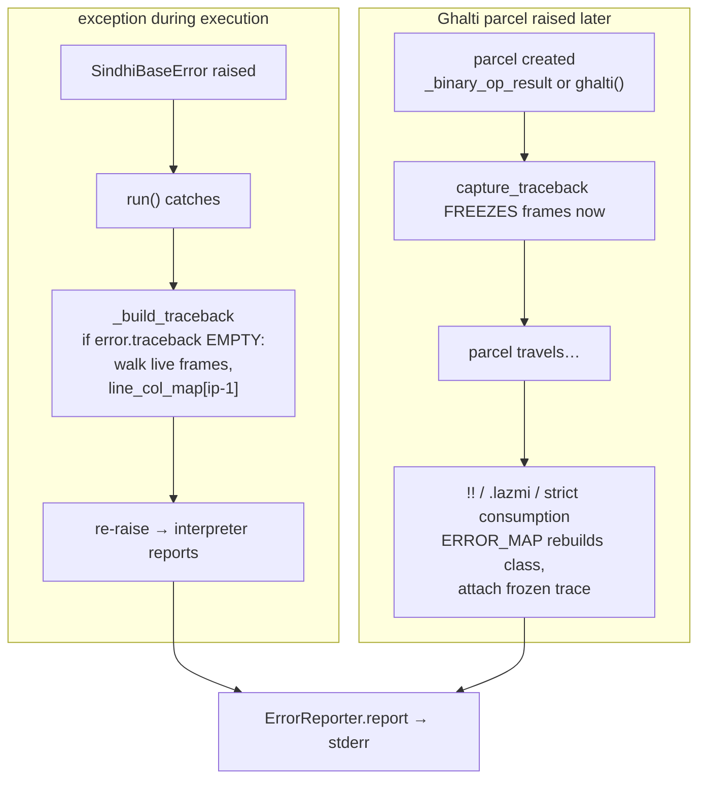

# Advanced VM Flows: Calls, Methods & Unwinding

📍 <strong>You are here:</strong> Part Seven · The Engine Room — 4 of 4

Three flows are too intricate for the field guide and deserve full diagrams: calling a Sindlish function, dispatching a method, and how errors acquire their beautiful tracebacks.

## Flow 1 · Calling a function

Details worth knowing (`vm.py:_call_sd_function`):

- **Binding priority**: explicit kwargs beat positionals; defaults evaluated *at definition time* ride on the `SdFunction`.
- **Result-aware binding**: an Ok parcel passed to a parameter is unwrapped before the declared type check; Ghalti passes through.
- **`*param` collects leftovers into a list, `**kw` into a dict.** Unknown kwarg names → clean `MatalabJeGhalti`.
- **Builtins have no signature**, so `kwarg_specs` is their entire parameter contract: names absent from it are rejected, declared ones arrive pre-filled with defaults. A builtin whose spec defaults to `KWARG_UNSET` reads the ones the caller really passed by identity (`silsilo`).
- The caller's stack is untouched by the callee — it gets a fresh frame with its own slots.

## Flow 2 · Method dispatch

The `ok/ghalti` special case exists because Results must be inspectable *without* consuming them — `.ok` is attribute-like syntax over this opcode.

## Flow 3 · How errors get dressed

Two independent traceback sources, one renderer:

The guard in `_build_traceback` ("only if empty") is what gives Result-born errors their birthplace fidelity — the freeze-at-creation trace wins over where the error finally detonated.

## Frame lifecycle recap

Frames push on call (`frames.append`) and pop on `RETURN_VALUE`. When `instructions` run out mid-frame (main program end), the loop pops single-frame programs via `HALT` pinning ip at the end — small subtlety: `HALT` doesn't stop the machine globally, it just ends the current frame's stream.

Calls = bind → fresh frame → append; builtins skip frames entirely.

Method dispatch = MRO walk with an ok/ghalti inspection shortcut.

Tracebacks: live-walk for plain exceptions, frozen capture for parcels; capture wins.

